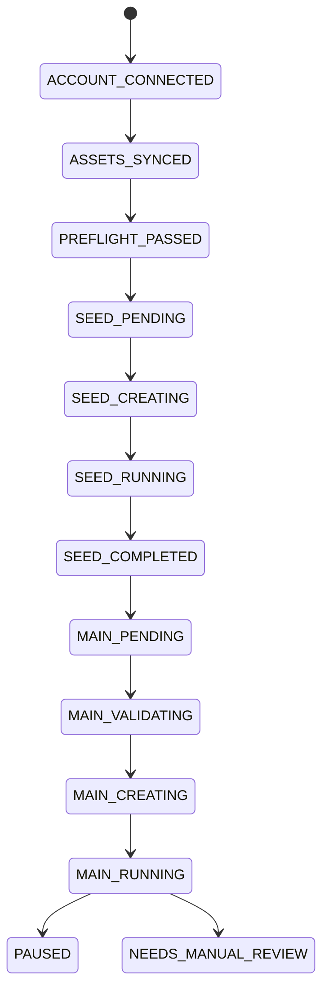

# Campaign automation

Campaign automation creates one durable workflow per advertising account. The core state machine and rule evaluator are provider-neutral; Meta, TikTok, and Google connectors implement application-owned ports.

Metrics and state changes share a PostgreSQL transaction. When seed spend reaches its configured threshold, the service validates both required transitions and stores the final `MAIN_PENDING` state atomically.

The Meta adapter cursor-paginates visible accounts and campaigns, and can pause a named campaign. A durable worker performs read-only sync immediately at startup and then on the configured interval. Campaign creation and budget mutation intentionally return `ErrNotImplemented` until deterministic validation, approval, idempotency, and audit-log guardrails are available.

The API currently supports workflow creation, listing, explicit transitions, metric ingestion, Meta sync status, manual sync, and sync history. Connector credential management, automation-rule CRUD, and tenant authorization remain future boundaries.
