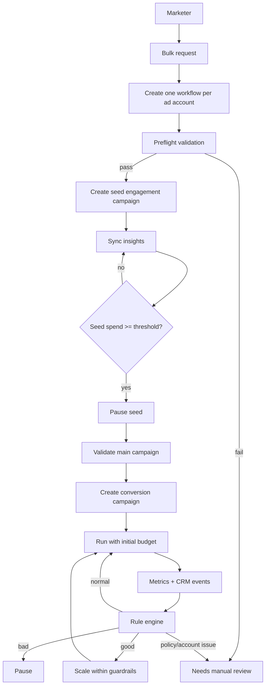
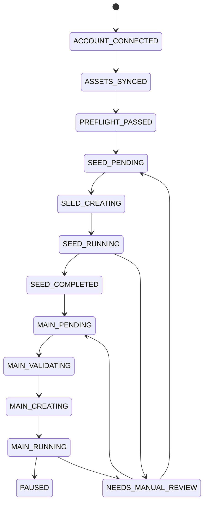
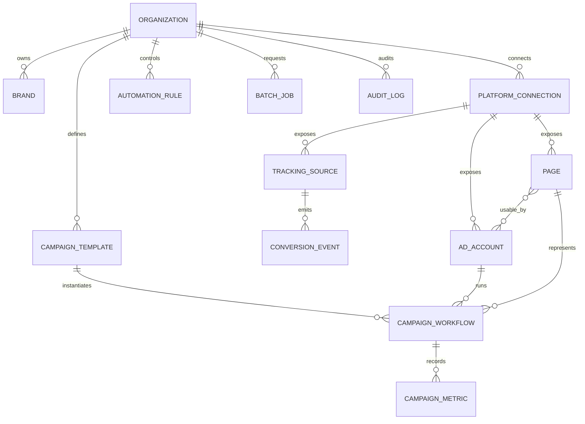

# Campaign Automation Architecture

## Goal

Support many organizations, brands, pages and advertising accounts while allowing one bulk action to create independent campaign workflows per ad account.

The automation is provider-neutral. Meta is the first adapter, while TikTok/Google can implement the same core interface later.

## Runtime flow

## Workflow state machine

Each advertising account owns its own workflow state. A failure on account B must not roll back successful work for accounts A or C.

## ERP / entity model

## Safety and execution boundaries

AI may propose targeting, copy, creatives and campaign configuration. Deterministic code must validate and execute money-impacting operations. Budget changes, pauses and publishing should go through configured rules, limits and audit logs.

Provider policy errors, account restrictions, payment failures and ambiguous asset ownership should transition to `NEEDS_MANUAL_REVIEW`; the platform must not attempt policy-evasion behavior.

## Worker design

The next persistence/worker iteration should separate these job classes:

- `asset.sync`
- `campaign.seed.create`
- `campaign.seed.monitor`
- `campaign.main.validate`
- `campaign.main.create`
- `metrics.sync`
- `rules.evaluate`
- `campaign.pause`
- `campaign.scale`
- `creative.generate`

Jobs must be idempotent and should carry an idempotency key based on workflow + operation + version.
